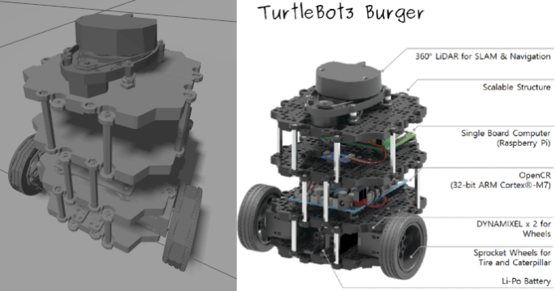
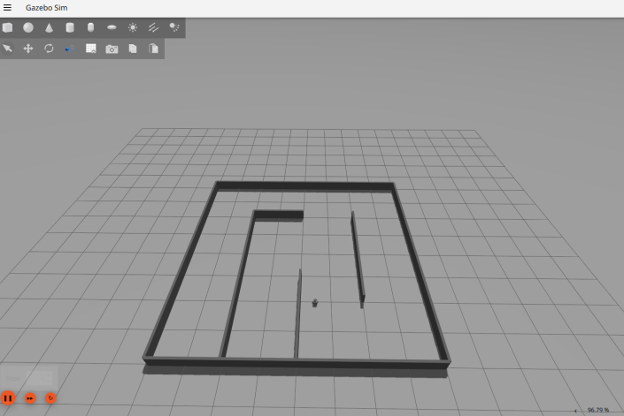
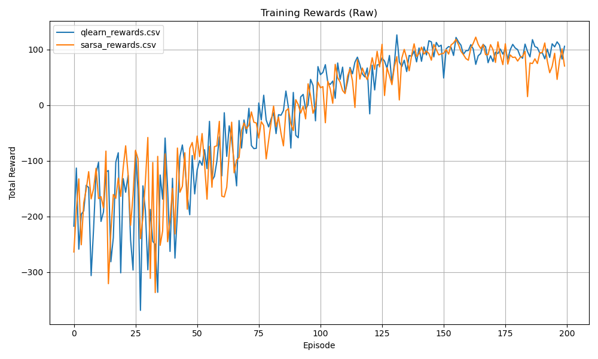
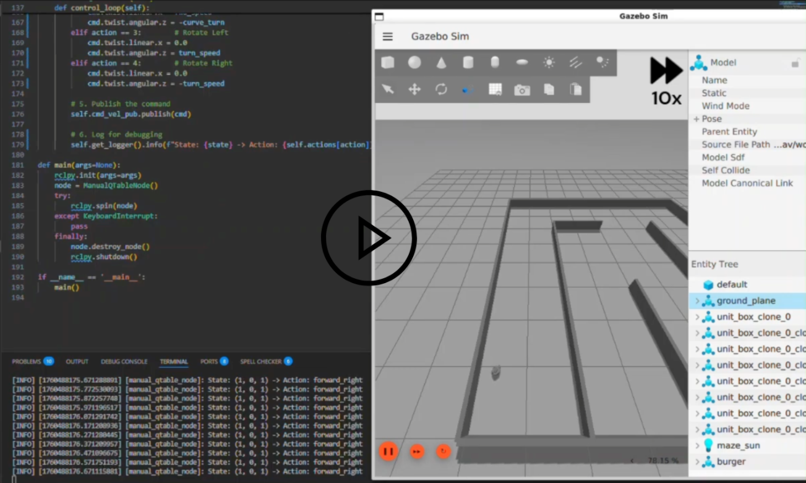
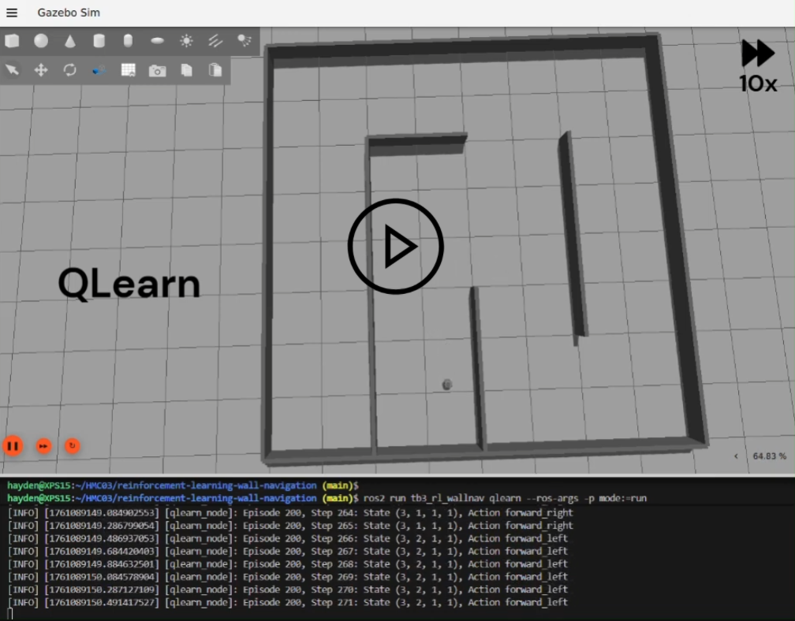
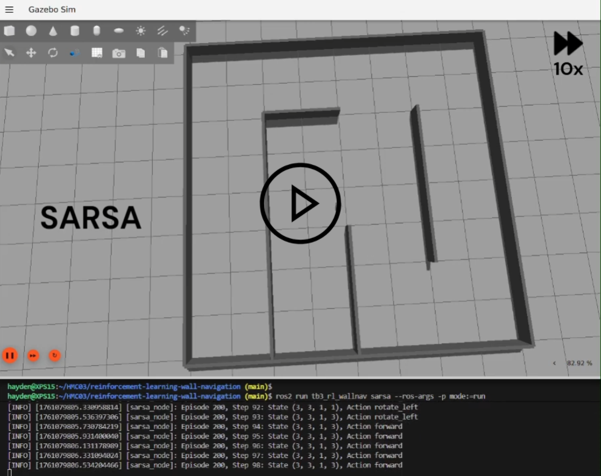
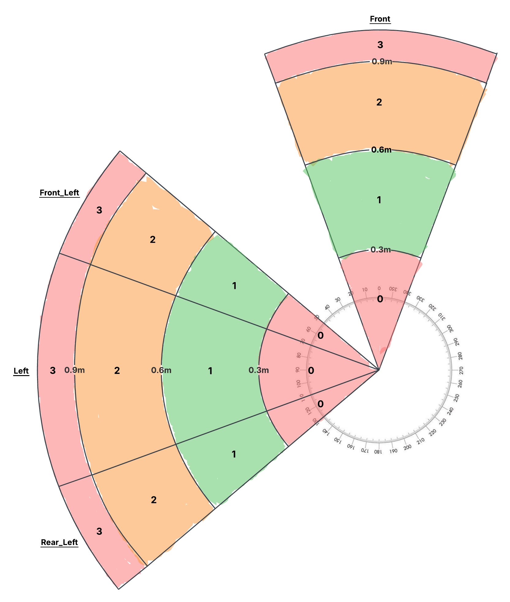

# Reinforcement Learning Wall Navigation for TurtleBot3

## Overview
This project implements reinforcement learning algorithms—Q-learning and SARSA—for enabling a TurtleBot3 robot to navigate a maze by following the left wall. It compares the performance of these methods against each other and a manually created Q-table policy. The simulation is conducted in Gazebo using a custom large maze environment. Key features include training scripts, reward tracking, Q-table conversion tools, and visualization utilities.

The repository includes submodules for TurtleBot3 dependencies and a custom ROS2 package (`tb3_rl_wallnav`) for the core functionality.

**License**: MIT

## Prerequisites
* **Operating System**: Ubuntu 22.04 or later (recommended for ROS2 compatibility).
* **ROS2**: Jazzy distribution. Install from [official instructions](https://docs.ros.org/en/jazzy/Installation.html).
* **Gazebo**: Version 11 or later, installed via ROS2 (e.g., `ros-humble-gazebo-ros`).
* **Python Libraries**: Required libraries (e.g., numpy, matplotlib, colorama) are handled via ROS dependencies. After cloning, run:
  ```bash
  rosdep update
  rosdep install --from-paths src --ignore-src -r -y
  ```
* Additional ROS packages (automatically handled via dependencies): rclpy, gazebo_ros, turtlebot3_gazebo, sensor_msgs, geometry_msgs, etc.

## Installation
1. Clone the repository and initialize submodules:
    ```bash
    git clone https://github.com/HMC03/reinforcement-learning-wall-navigation.git
    cd reinforcement-learning-wall-navigation
    git submodule update --init --recursive
    ```

2. Source your ROS2 installation:
    ```bash
    source /opt/ros/jazzy/setup.bash
    ```

3. Build the workspace using colcon:
    ```bash
    colcon build --symlink-install
    ```

4. Source the workspace:
    ```bash
    source install/setup.bash
    ```

5. Define robot model:
    ```bash
    export TURTLEBOT3_MODEL=burger
    ```

## Repository Structure

* `src/`: Source code directory.
    * `tb3_rl_wallnav/`: Custom ROS2 package for wall navigation.
        * `launch/`: Launch files for Gazebo and RViz simulations.
        * `media/`: Images and videos (e.g., LIDAR visualizations, training demos, reward graphs).
        * `qtables/`: Q-tables in binary (.npy) and text (.txt) formats, with a conversion script.
        * `rewards/`: CSV files for episode rewards and a plotting script.
        * `rviz/`: RViz configuration for visualization.
        * `worlds/`: Custom Gazebo world file (largemaze.world).
        * `tb3_rl_wallnav/`: Python scripts for nodes (e.g., qlearn.py, sarsa.py).
    * `DynamixelSDK/`, `turtlebot3/`, `turtlebot3_msgs/`, `turtlebot3_simulations/`: Submodules for TurtleBot3 hardware and simulation support.
* `build/`, `install/`, `log/`: Generated directories from colcon build (ignored in .gitignore).

## Usage
### Launching the Simulation

* Start the Gazebo simulation with the large maze:
    ```bash
    ros2 launch tb3_rl_wallnav gz_tb3_largemaze.launch.py
    ```
* Or with RViz for visualization:
    ```bash
    ros2 launch tb3_rl_wallnav gz_rviz_tb3_largemaze.launch.py
    ```

### Running Nodes

* _LIDAR Debug Node_ (`lidar_debug.py`): Prints color-coded average distances from LIDAR segments for debugging.
    ```bash
    ros2 run tb3_rl_wallnav lidar_debug
    ```

* _Manual Q-Table Node_ (`manual_qtable.py`): Uses a predefined policy to control the robot based on discretized LIDAR states.
    ```bash
    ros2 run tb3_rl_wallnav manual_qtable
    ```

* _Q-Learning Node_ (`qlearn.py`): Trains or runs the Q-learning agent.

    * Train mode (starts/resumes training with exploration):
        ```bash
        ros2 run tb3_rl_wallnav qlearn --ros-args -p mode:=train -p epsilon:=1.0
        ```

    * Run mode (uses trained Q-table without exploration):
        ```bash
        ros2 run tb3_rl_wallnav qlearn --ros-args -p mode:=run
        ```


* _SARSA Node_ (`sarsa.py`): Similar to Q-learning but uses on-policy SARSA updates.

    * Train mode:
        ```bash
        ros2 run tb3_rl_wallnav sarsa --ros-args -p mode:=train -p epsilon:=1.0
        ```

    * Run mode:
        ```bash
        ros2 run tb3_rl_wallnav sarsa --ros-args -p mode:=run
        ```

Training saves Q-tables to `qtables/` and rewards to `rewards/`. Episodes reset the robot to one of four predefined locations with x,y,yaw noise (cycling through them) upon termination (collision, lost state, or max steps).

### Analysis and Visualization
After training, analyze results using tools in the `src/tb3_rl_wallnav/` subdirectories. For details, see their READMEs (e.g., `qtables/README.md`, `rewards/README.md`).

* _Plot Training Rewards_: In `src/tb3_rl_wallnav/rewards/`, use `plot_rewards.py` to visualize episode rewards (raw or moving average) from CSV files.
    * Show raw rewards data:
        ```bash
        python3 plot_rewards.py raw
        ```
    * Or moving average of rewards data with custom window size:
        ```bash
        python3 plot_rewards.py average 10  # Window of 10
        ```

* _Convert Q-Tables to Text_: In `src/tb3_rl_wallnav/qtables/`, use `convert_qtable_to_txt.py` for human-readable versions.
    ```bash
    python3 convert_qtable_to_txt.py qlearn_qtable.npy qlearn_qtable.txt
    ```

## Results and Demonstrations

This section showcases key results from training and demonstrations of the policies. Media files are stored in src/tb3_rl_wallnav/media/ for easy access. Use these to visualize performance comparisons between Q-learning, SARSA, and the manual policy.

### Simulation Environment
* `turtlebot3_burger.png`: TurtleBot3 Burger model used in this project
    

* `largemaze_world.png`: Top-down view of the custom large maze used for training and testing.
    

### Training Results

* `rewards_comparison.png`: Plot comparing total rewards over episodes for Q-learning vs. SARSA (generated via `plot_rewards.py` with moving average).
    

### Policy Demonstrations
* `manual_policy_demo_10x.mp4`: Video of the manual Q-table policy navigating the maze (sped up 10x for brevity).
    <a href="https://youtu.be/IlXwCysuNBk"></a>

* `qlearn_policy_demo_10x.mp4`: Video of the trained Q-learning policy navigating the maze (sped up 10x).
    <a href="https://youtu.be/cb2j77RnSZY"></a>
    
* `sarsa_policy_demo_10x.mp4`: Video of the trained SARSA policy navigating the maze (sped up 10x).
    <a href="https://youtu.be/YhoA3lS6U7A"></a>

### State Space Visualization

* `lidar_state_space.png`: Diagram illustrating the LIDAR segmentation into four regions (front, front_left, left, rear_left) around a circle, with distance categories (0-4) highlighted for state discretization.
    

